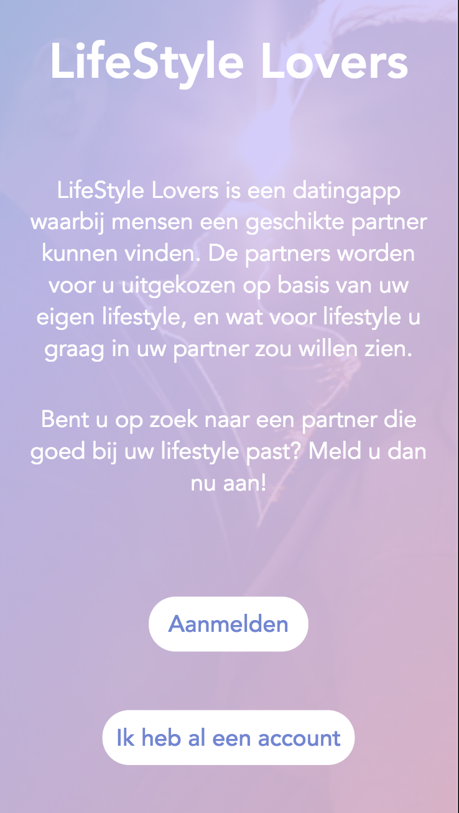
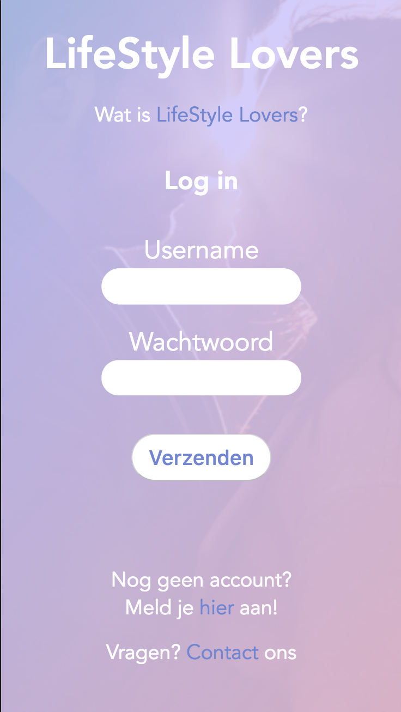
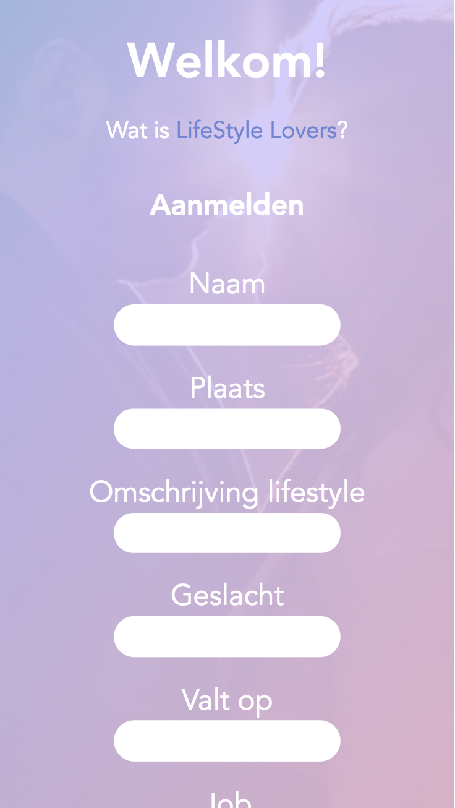
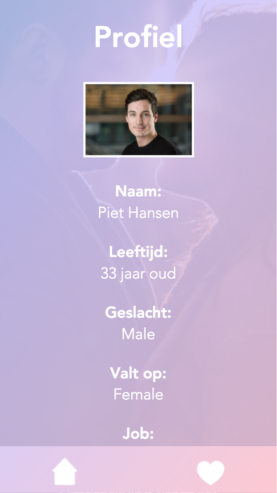
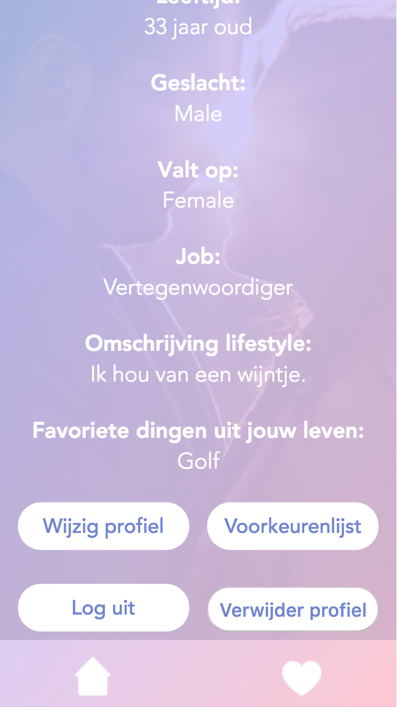
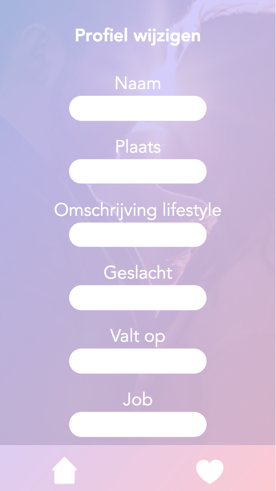
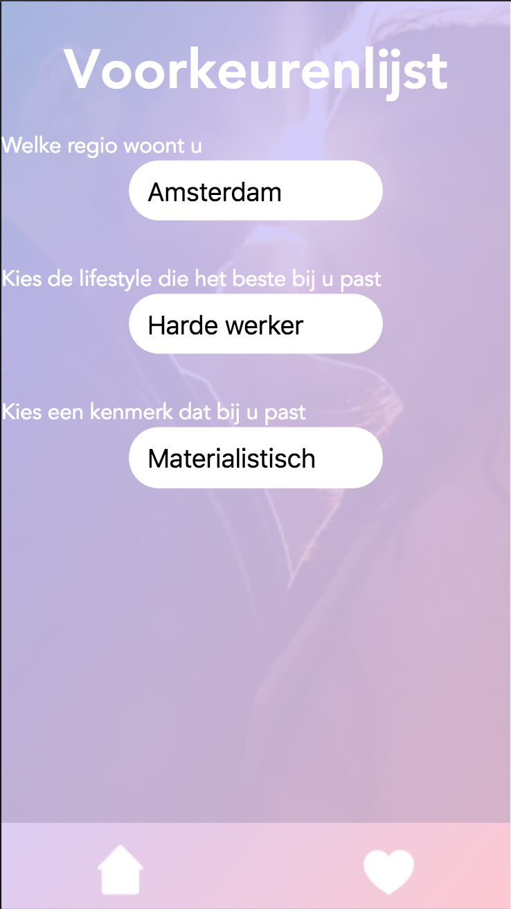
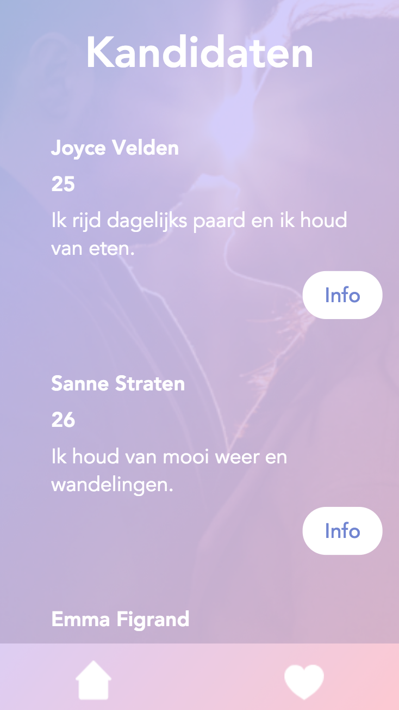
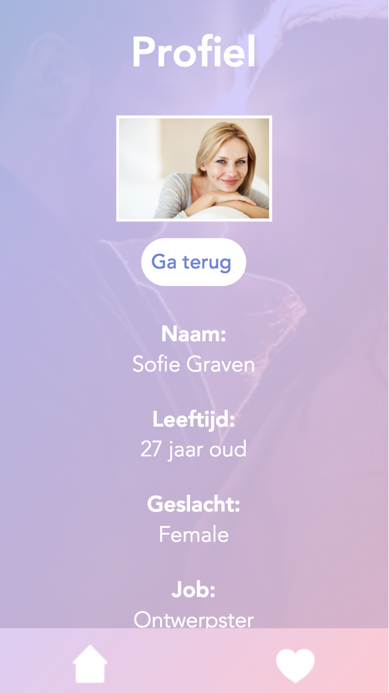
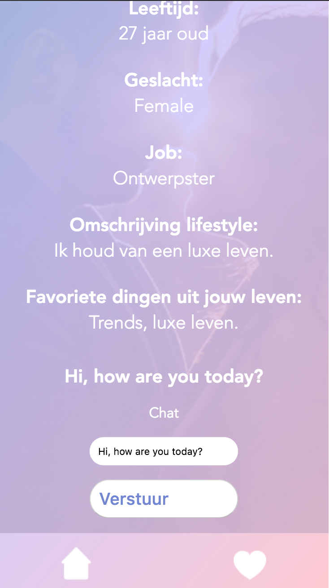

# Lifestyle Lovers
My application is a dating application where users can find a partner that can fit in their lifestyle. 
The age is between 20 and 40, and it's only for people that want to find someone that can suit their lifestyle.
In that way you can find a partner that suits your life and also has the same interests as you have. 



## Description App
So let's go through my application to see how you navigate and how it works. 
Okay so the first page you see is the intro page, where the app is being explained, and where you can choose if you already have an account or want to register. The user can always go back to read the intro again. 



After the user signs up or logs in, he or she sees their profile page with their own data. From there the user can go to the matches page, to update or change the profile, to log out, to delete the profile and to the preferences list. 
After the user updates or changes their profile, it will be changed/updated and saved in the database, the profile data will also be changed/updated on the website. The preferences page is a page where the user can choose between some situations and overall meanings of life and stuff. I haven't finished this page so that's why it looks like this. Eventually I want to make this the page where they describe their lifestyle, and choose from different situations.



If the user clicks on the heart icon in the navigation bar, the user will go to the matches page. That page contains accounts from the database, that match with the user. The user can click on info to check out their detail page and to chat with them. 



So when the user wants to talk to a person, it can be done at the profile page of that person.  
The user can send a message, and it will be shown above the input. If the other person sends something back, it will also be shown there.



It's still a very small application because I didn't have enough time to make it the way I want. I'm very happy that the backend part of this project worked, that was the most important thing on the list. If I had more time I would spend more time on security of the application, and on errors. 

## Install
If you want to install my application, you have to do the following:

**1.** First you have to git clone my link: 
```javascript
git clone https://github.com/ninavanbergen/be-assessment-2.git
```
**2.** Then you need to go to that file, by doing so:
(if you renamed the file then you need to change the name after cd /)
```javascript
cd /be-assessment-2.git 
```
**3.** When you're in the file, you need to install some things, let's start with npm. [Here](https://github.com/npm/npm) is a link to an explanation of npm.
(you will see a download bar, it may take a while)
```javascript
npm install
```
After you've done ```npm install``` it is nice to also make an package.json file. You can make that by doing this:
```javascript
npm init
```

In the following steps you will learn how to install all the things that you will need to make the application work. I will explain later how you require them all in your js file.
**4.** Let's begin with installing express! But what is express? [Here](https://github.com/expressjs/express) is a link to an explanation of express.
(again, you may see a download bar, it may take a while)
```javascript
npm install express
```
**5.** We also need to install body-parser. It's a plugin for express, that makes the values that are found in the application easier to read. [Here](https://github.com/expressjs/body-parser) is a full explanation of it. 
```javascript
npm install body-parser
```
**6.** Let's install multer. [Here](https://github.com/expressjs/multer) is a full explanation of it.
```javascript
npm install multer
```
**7.** Right now we are going to install a very important one. It's called MySQL. 

[Wikpedia](https://nl.wikipedia.org/wiki/SQL) says:
> SQL (Structured Query Language) is a […] language used in programming and designed for managing data held in a relational database […].

If you don't understand it right away, don't worry, I had the same. Here are some links that explain it more and show you some examples of how to work in MySQL:

* [Link 1](https://www.mysql.com/about/)

* [Link 2](https://gist.github.com/hofmannsven/9164408)

* [Link 3](https://www.guru99.com/sql.html)

Take your time to read these websites and to understand MySQL, because if you know how mysql works, you will understand my code much better! 

The first thing you need to do before you'll download MySQL, is download [homebrew](https://brew.sh). Click on the link to see how to download it. 

If that succeeds, you need to do an update of homebrew:
```javascript
brew update
```
And finally we are going to install MySQL:
```javascript
brew install mysql
```
**8.** We are also going to install [multer](https://github.com/expressjs/multer):
```javascript
npm install multer
```
**9.** Finally, the last thing we need to install is [session](https://github.com/expressjs/session):
```javascript
npm install express-session
```

That's it! You now have installed all the things you need to make the application work. Good job.

## Start Server 
If you want to start the server, you need to do this in your terminal:
```javascript
npm start
```

## Structure of the project (files, folders)
My project has some important files and some folders. The server.js file is the file that contains all of my main code. There are a lot of comments there to make it easier to understand. In my static folder are all the 'static' files, so files like css and images. They don't change, that's why they are called static. I also have a folder named view. View contains all of my ejs templates that will be needed in this project, they are templates for every page in my project. 

## Server.js 
Like I said, I made an server.js file that contains all of my main code to make my project work. It binds everything together, I had a lot of work doing this one. Here I am going to explain what you need to have in your server.js to link all the packages we just installed. 

So, we've just installed some things like express and multer and MySQL. The following code links those installed packages and more to my project:
```javascript
var express = require('express')
var mysql = require('mysql')
```
I've done this for all of them, so for express, multer, mysql, express-session and body-parser. But also path and ejs. I haven't installed those, but you do need to link them in your file. 
So I also worked with a lot of app.get and app.post codes, those are requests and responses. The app.post is needed for when someone tries to log in or register. The user basically posts something. The app.get is when someone wants to get a thing from a page, for example going to another page. This is an example of an app.get and an app.post that I have in my server.js file. 
```javascript
app.post('/portal', handleLogin)
app.get('/profile/:id', profile)
```
So, when /portal is being asked, the function handleLogin will be runned. This one is about logging in so that is why it is an app.post = the user posts data. /profile/:id is where the user goes after logging in. /:id will be changed by the id of the user. That id is stored in my MySQL database. The function profile will also be runned. This is the function profile, with comments ofcourse:
```javascript
// In this function you render the template profile.ejs, with data
// This function belongs to app.get('profile/:id', profile)
// You want to go to your personal profile page
// That's why you need to have your id first
// That will be shown in the browser, just like shelter at some animal detail page
function profile(req, res) {
  var id = req.params.id
  // Here you're connecting with your databse, it selects * = all from the table accounts,
  // And you're asking for the id. After that there is a function being called
  connection.query("SELECT * FROM accounts WHERE id = ?", id, function(err, users) {
    // When something doesn't go as planned, you will get an error, the server stops
    if (err) throw err
    var user = users[0]
    // Locals is named locals becauce it contains all the local variables that we give to a template
    // The req.session shows us who is logged in, and that someone is logged in
    var locals = {
      data: user,
      session: req.session
    }
    // If everything succeeds, the server renders profile.ejs, with the data from locals in it
    res.render("profile.ejs", locals)
  })
}
```

## Database 
How you log in to your database:
```javascript
mysql -u root
```
Root is my username, that is defined in my server.js file. 


For this project I used a MySQL database. I actually enjoyed working with it. I already showed how you install MySQL.
I'm now going to show you how I made my table and how I inserted my data, how I updated data and how I deleted data. 
But first I need to show you how you make a database:
```javascript
CREATE DATABASE IF NOT EXISTS datingsite;
```
It's very important that you don't forget the ; after the code because it won't run otherwise. I named my database datingsite. 
To work in that database you need to do the following:
```javascript
use datingsite
```
Then I created my first table by doing so:
```javascript
CREATE TABLE IF NOT EXISTS accounts (
    ->   id INT NOT NULL AUTO_INCREMENT,
    ->   name TEXT CHARACTER SET utf8,
    ->   place TEXT CHARACTER SET utf8,
    ->   description TEXT CHARACTER SET utf8,
    ->   sex TEXT CHARACTER SET utf8,
    ->   job TEXT CHARACTER SET utf8,
    ->   favorites TEXT CHARACTER SET utf8,
    ->   age TEXT CHARACTER SET utf8,
    ->   username TEXT CHARACTER SET utf8,
    ->   password TEXT CHARACTER SET utf8,
    ->   PRIMARY KEY (id)
    -> );
```
I named my table accounts, because I wanted to store all my accounts in there. 
I also wanted to add another column to my table, named img. I did it this way:
```javascript
ALTER TABLE accounts ADD img BLOB;
```
I added some accounts to my table, by doing so:
```javascript
INSERT INTO accounts (name, place, description, sex, job, favorites, age, username, password) VALUES (‘Gary Crown’, ‘Amsterdam’, ‘I like football’, ‘Male’, ‘Chef’, ‘Football, Food’, ’21’, ‘gary’, ‘gary’);
```
If you want to see the table:
```javascript
SELECT * FROM accounts;
```
I eventually wanted to change some values in the table, I used this:
```javascript
UPDATE accounts SET name = 'Tom' WHERE place= 'Amsterdam';
```

Do delete something, you need to do this:
```javascript
DELETE FROM accounts WHERE name='Tom';
```
And after adding some more, here is how my table looks:

| id | name | place | description | sex | job | favorites | age | username | password |
|---|---|---|---|---|---|---|---|---|---|
| 1 |  Tom  | Amsterdam | I like Football | Male | Chef | Football, Food | 21 | gary | gary |


I also made an message table, that contains the messags that are being send by the user 

| id | chatting | me | other |
|---|---|---|---|
| 1 | Hi! | 1 | 5 |

## My To-Do list
- [x] Make a repository and name it: be-assessment-2. Also Include a README.md
- [x] The user can login and logout
- [x] The user can sign up or register
- [x] The user can edit or delete their account
- [x] Make the match method work, so that the list of matches can be filtered
- [x] Make sure that you linked every page to another property
- [x] Make comments in your code, to make it more understandable
- [x] Make your code consistent
- [x] Add a database and create tables
- [x] Add a license
- [ ] Hash passwords to increase the security


## License
[MIT](https://github.com/jessiemasonx/be-assessment-2/blob/master/LICENSE)
